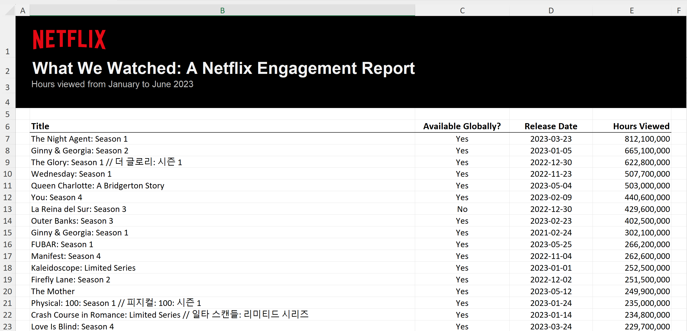

# Enhancing Netflix Engagement Data: Leveraging AI for Content Classification and Analysis

## Table of Contents
1. [Project Goal](#project-goal)
2. [Business Understanding](#business-understanding)
3. [Data Understanding](#data-understanding)
4. [Data Preparation](#data-preparation)
5. [Modeling](#modeling)
6. [Evaluation](#evaluation)
7. [Conclusion](#conclusion-1)
8. [Next Steps](#next-steps)


## Project Goal
Enhance Netflix engagement data using the LangChain Framework, OpenAI ChatGPT API, and Few-Shot Prompting to classify 18,000 titles as Netflix Original Content or not, and determine the content type (e.g., film, series, documentary).

## Business Understanding

### Specific Business Objectives

1. **Data Usability:** The enriched dataset provides comprehensive insights into the nature of Netflix's content, facilitating more in-depth analysis and strategic decision-making.
2. **Efficient Classification:** Automate the classification of Netflix Originals and content types, reducing the time and resources required for manual classification.
3. **Scalable Solution:** Establish a scalable approach that can be applied to larger datasets in the future, ensuring continuous improvement of data quality.
4. **Informed Decision-Making:** The enhanced data supports Netflix's distribution strategy and content acquisition decisions by providing clear distinctions between original and licensed content and detailed content types.
5. **Cost-Effective:** Utilize advanced AI techniques to enhance data at a low cost, demonstrating the value of integrating AI-driven solutions into data analysis workflows.

### Key Business Requirements

1. Achieve at least 90% accuracy in content classification.
2. Achieve a cost lower than the average data analyst salary ($40.50/hr according to Glassdoor) in Los Angeles, CA where Netflix is located.
3. Ensure scalability and seamless integration with Netflix infrastructure.

### Success Criteria and KPIs

1. **Classification Accuracy:** Target: > 90%
2. **Cost Efficiency:** Cost: < $40.50/hr
3. **Processing Time:** Less than 1 second per title

## Data Understanding

### Data Source

On December 12th, 2023, Netflix published “What We Watched: A Netflix Engagement Report,” which contained engagement data from January 2023 to June 2023. This comprehensive report , available [here](https://about.netflix.com/en/news/what-we-watched-a-netflix-engagement-report),  includes:

- **Title:** The title of the content.
- **Available Globally?:** Whether a title was available globally.
- **Release Date:** The premiere date for any Netflix TV series or film.
- **Hours Viewed:** Hours viewed for every title watched for over 50,000 hours.

In total, this report covers more than 18,000 titles — representing 99% of all viewing on Netflix — and nearly 100 billion hours viewed. The data was downloaded as an Excel file.



### Dataset Description

**Data Dictionary:**

| Column              | Description                                                      | Data Type       |
|---------------------|------------------------------------------------------------------|-----------------|
| Title               | The title of the content.                                        | String          |
| Available Globally? | Indicates whether a title was available globally (Yes/No).       | String          |
| Release Date        | The premiere date for content on Netflix.                        | Date (YYYY-MM-DD) |
| Hours Viewed        | Hours viewed for every title watched for over 50,000 hours.      | Integer         |

**Summary Statistics:**

| Statistic           | Title   | Available Globally? | Release Date | Hours Viewed    |
|---------------------|---------|---------------------|--------------|-----------------|
| Count               | 18,214  | 18,214              | 4,855        | 18,214          |
| Unique Values       | 18,214  | 2                   | 1,665        | -               |
| Most Frequent Value | -       | No                  | 3/20/2020    | -               |
| Frequency           | -       | 13,700              | 16           | -               |
| Mean                | -       | -                   | -            | 5,130,954       |
| Std Dev             | -       | -                   | -            | 18,717,670      |
| Min                 | -       | -                   | -            | 100,000         |
| 25%                 | -       | -                   | -            | 200,000         |
| 50%                 | -       | -                   | -            | 700,000         |
| 75%                 | -       | -                   | -            | 3,400,000       |
| Max                 | -       | -                   | -            | 812,100,000     |

### Visual Insights from the Exploratory Data Analysis (EDA)

1. **Distribution of Global Availability:**
   - A bar chart reveals a significant difference in the number of titles available globally versus those not available globally. With 4,514 (25%) titles available globally, a larger proportion, 13,700 (75%) titles, are not available for streaming worldwide.
   
   - 

2. **Viewership Distribution:**
   - A histogram, using a logarithmic scale due to the wide range of viewership hours, showcases the distribution of "Hours Viewed" across titles. Most titles have relatively low viewership hours, with a few exceptions reaching extremely high viewership, indicating a long-tail distribution where a small number of titles capture the majority of viewing hours.
   
   - 

3. **Distribution of Release Years for Netflix Titles:**
   - A bar chart shows annual title releases from 2010 to 2023, revealing a steady increase that peaks in 2022. Data for 2023 only covers January to June.
   
   - 


### Data Quality Issues and Initial Findings

**Missing Values:**

The bar chart below shows the number of missing values in each column. The "Release Date" column has a significant number of missing values (13,359), while other columns have no missing values.


**Initial Findings:**

1. **Missing Release Dates:** A significant number of missing values were identified in the "Release Date" column. This issue can be resolved by merging the dataset with an external data source available at the following public GitHub URL: [Netflix 2023 Analysis](https://github.com/FlamingoCalves/netflix-2023-analysis/tree/master).
2. **Skewed Distribution of Viewing Hours:** The data shows a highly skewed distribution of hours viewed, with the majority of titles having low engagement and a small number of titles having exceptionally high engagement.
3. **Additional Columns for Enhanced Insights:** Introducing new columns such as "is_original" and "content_type" could significantly improve the dataset’s usability and the depth of insights derived. Data for these additional columns was not readily available online, highlighting the necessity of utilizing Large Language Model (LLM) APIs for data extraction.

These visualizations and findings provide a foundation for further data preparation and modeling steps.

## Data Preparation

### Data Cleaning and Preprocessing

**Overview:**
The data cleaning and preprocessing steps were critical in preparing the raw engagement data for enhancement. Custom functions were created to clean and preprocess the title strings, ensuring consistency and removing unnecessary information.

**Steps:**

1. **Title String Cleaning:**
   - Created custom functions to clean the strings in the "Title" column and create a new column "Clean_Title".
   - Removed season info from titles and created another column "Season_Num" to record the season number.
   - Removed all special characters that were not alphanumeric and converted all letters to lowercase.
   - Filtered out all "Clean_Title" entries with a character length of less than 10, except for those with "Hours Viewed" greater than or equal to 700,000 (the median for the entire dataset). A total of 465 records met the exception criteria.

2. **Helper Functions:**
   - `remove_special_characters`: Removes all special characters from a string and converts it to lowercase.
   - `remove_season`: Removes the word "season" from the title string.
   - `parse_season_number`: Parses the season number from the title string and returns it as an integer.
   - `contains_numbers`: Checks if a title string contains any numerical values and returns a boolean value.
   - `char_len`: Counts the number of characters in the title string and returns an integer.
   - `format_title_question_isoriginal`: Takes an input string parameter "input_title" and returns a string in the format "Is title '{input_title}' original Netflix content?"
   - `format_title_question_content_type`: Takes an input string parameter "input_title" and returns a string in the format "Is Netflix title '{input_title}' a Series, Movie, or Documentary?"

**Data Cleaning Steps:**

1. **remove_special_characters:**
   - Applied to the "Title" column to create the "Clean_Title" column.

2. **remove_season:**
   - Applied to remove the word "season" from titles.

3. **parse_season_number:**
   - Extracted season numbers from titles and recorded them in the "Season_Num" column.

4. **contains_numbers:**
   - Checked for numerical values in titles to aid in cleaning.

5. **char_len:**
   - Used to filter out short titles, ensuring only meaningful titles were retained.

**Final Cleaned Data:**
- Grouped by the "Clean_Title" column to avoid duplicate classification and save on API costs.
- Ensured the cleaned and preprocessed data was ready for the enhancement process using the LangChain Framework and OpenAI API.

**Final Cleaned Data Dictionary:**

| Column                   | Description                                                                                        | Data Type |
|--------------------------|----------------------------------------------------------------------------------------------------|-----------|
| Clean_Title              | The cleaned version of the title, with special characters removed.                                 | String    |
| Title_Counts             | The number of times a title appears in the dataset.                                                | Integer   |
| Clean_Title_Char_Len     | The character length of the cleaned title.                                                         | Integer   |
| is_original_Prompt       | A formatted string prompting the question if the title is original Netflix content.                | String    |
| Content_Type_Prompt      | A formatted string prompting the question of whether the title is a Series, Movie, or Documentary. | String    |

By following these steps, the raw data was transformed into a clean and structured format, enabling accurate and efficient data enhancement.

## Modeling

### Custom Class: `Netflix_Few_Shot_Class`

This class is designed to facilitate the creation and execution of few-shot learning prompts using the LangChain library, specifically tailored for determining details about Netflix titles. It encapsulates the process of defining a prompt template, setting up few-shot examples, initializing a language learning model (LLM), and parsing the output.

**Methods:**

- **create_example_prompt(template, input_variables):** Defines the prompt template with placeholders for input variables.
- **create_few_shot_examples(examples_list):** Sets up few-shot examples based on the provided list.
- **load_llm_model(llm_model):** Loads the specified LLM model for generating responses.
- **load_parser_object():** Initializes an output parser for parsing the response from the LLM.
- **chain_components():** Chains the few-shot prompt, LLM model, and output parser together for execution.
- **run_chain(input_question):** Executes the chained components with the given input question, returning the LLM's response.

### Usage:

1. **Initialize the class with an API key for OpenAI.**
   ```python
   netflix_few_shot = Netflix_Few_Shot_Class(api_key='your_openai_api_key')
   ```

2. **Call `create_example_prompt` with a template string and list of input variables.**
   ```python
   template = "Is title '{title}' original Netflix content?"
   input_variables = ['title']
   netflix_few_shot.create_example_prompt(template, input_variables)
   ```

3. **Call `create_few_shot_examples` with a list of examples matching the template structure.**
   ```python
   examples_list = [
       {'question': "Is title 'stranger things' original Netflix content?", 'answer': 'Yes'},
       {'question': "Is title 'trolls' original Netflix content?", 'answer': 'No'},
       {'question': "Is title 'money shot the pornhub story' original Netflix content?", 'answer': 'Yes'},
       {'question': "Is title 'avatar the last airbender' original Netflix content?", 'answer': 'No'}
   ]
   netflix_few_shot.create_few_shot_examples(examples_list)
   ```

4. **Create a `ChatOpenAI` object with your API key and preferred model, then pass it to `load_llm_model`.**
   ```python
   llm_model = ChatOpenAI(api_key='your_openai_api_key', model='gpt-3.5-turbo')
   netflix_few_shot.load_llm_model(llm_model)
   ```

5. **Call `load_parser_object` to initialize the output parser.**
   ```python
   netflix_few_shot.load_parser_object()
   ```

6. **Call `chain_components` to prepare the execution pipeline.**
   ```python
   netflix_few_shot.chain_components()
   ```

7. **Use `run_chain` with a specific question to get the processed response from the LLM.**
   ```python
   class_response = netflix_few_shot.run_chain("Is title 'spongebob squarepants' original Netflix content?")
   print(class_response)
   ```

8. **Output:**
   ```python
   {
       'input': "Is title 'spongebob squarepants' original Netflix content?",
       'text': 'Answer No'
   }
   ```

### Batch Processing:

- To avoid timeout errors and API rate limits, data enhancement must be performed through batch calls.
- Ran chunks of 1,000 records per batch for a total of 15 batches.
- 14.6k rows took 1 hour 43 minutes to run using `gpt-3.5-turbo`.
- 14.6k rows took 2 hours 42 minutes to run using `gpt-4-turbo`.

By following these steps, the `Netflix_Few_Shot_Class` provides a structured and efficient way to leverage few-shot learning for enhancing the classification of Netflix content, making use of advanced AI techniques with the LangChain framework and OpenAI API.

## Evaluation

### Objective
The objective of this evaluation is to assess the performance of the models used for classifying Netflix content to ensure they meet the specified business objectives.

### Evaluation Steps

1. **Web Scraping for Ground Truth Data:**
   - Web scraped tables containing Netflix Original content from the URL: [Wikipedia: List of Netflix Original Programming](https://en.wikipedia.org/wiki/List_of_Netflix_original_programming).
   - Used custom web scraping tools developed with pandas and BeautifulSoup, named `scrape_tables_from_url`, `html_table_to_dataframe`, `webscrape_table_pipeline`, and `format_netflix_dfs`.
   - Successfully scraped 618 titles identified as Netflix Original content.

2. **Data Cleaning:**
   - Applied the same data cleaning tools from the data preparation step to create a `Clean_Title` column in the scraped dataset.
   - Created a column `wiki_is_original` containing the string "Yes" for easier analysis once joined with the model output data.

3. **Data Merging:**
   - Performed a full outer join on the LLM output dataset and the web scraped Wikipedia original content data on the `Clean_Title` column. This ensured all records remained after the merge, providing a more comprehensive analysis.
   - Out of the merged data, 145 records mapped between the Wikipedia data and the model output data. This subset was used to evaluate the model performance.

### Evaluation Results

| Model     | Accuracy | Processing Time | Cost    |
|-----------|----------|-----------------|---------|
| GPT-3.5   | 46.9%    | 103 minutes     | $0.75   |
| GPT-4     | 96.6%    | 163 minutes     | $13.95  |

- **Model Accuracy:**
  - **GPT-4:** Achieved an accuracy of 96.6%, outperforming GPT-3.5 by 49.7%.
  - **GPT-3.5:** Achieved an accuracy of 46.9%.
  - 


  This represents a 105.96% improvement in accuracy with GPT-4 compared to GPT-3.5. Model GPT-4, with its 96.6% accuracy, meets the business requirement for classification accuracy, which is set at a target greater than 90%.

- **Processing Time:**
  - **GPT-3.5:** Took approximately 103 minutes.
  - **GPT-4:** Took approximately 163 minutes.
  - 


  GPT-3.5 had a faster processing time, outperforming GPT-4 by approximately 60 minutes, which is a 58.25% reduction in processing time.

- **Cost Efficiency:**
  - **GPT-3.5:** Total cost was $0.75.
  - **GPT-4:** Total cost was $13.95.
  - 


  GPT-3.5 was significantly cheaper, with a cost difference of $13.20, translating to a 1760% cost reduction compared to GPT-4. Despite the higher total cost, GPT-4's cost per hour is $5.14, well within the business requirement for cost efficiency, which stipulates a cost less than $40.50 per hour.

- **Overall Performance:**
  - **GPT-4:** Met all business requirements, with an accuracy of 96.6%, a cost per hour of $5.14, and a processing time of 0.67 seconds per title.
  - **GPT-3.5:** Although it had a faster processing time and lower total cost, it did not meet the accuracy requirement.


Model GPT-4 is the preferred choice for this project, as it meets all business requirements for accuracy, cost efficiency, and processing time. Despite a higher total cost and longer processing time, its superior accuracy and cost-effectiveness per hour make it the optimal solution for classifying Netflix content.

## Conclusion

This project successfully enhanced Netflix's engagement data by leveraging the LangChain Framework, OpenAI ChatGPT API, and Few-Shot Prompting. The enhancement process involved creating two additional columns, "is_original" and "content_type," for each of the 18,000 titles in the dataset.

### Key Achievements

- **Data Usability:** The enriched dataset provides comprehensive insights into the nature of Netflix's content, facilitating more in-depth analysis and strategic decision-making.
- **Efficient Classification:** Automated the classification of Netflix Originals and content types, reducing the time and resources required for manual classification.
- **Scalable Solution:** Established a scalable approach that can be applied to larger datasets in the future, ensuring continuous improvement of data quality.
- **Informed Decision-Making:** The enhanced data supports Netflix's distribution strategy and content acquisition decisions by providing clear distinctions between original and licensed content and detailed content types.
- **Cost-Effective:** Utilized advanced AI techniques to enhance data at a low cost, demonstrating the value of integrating AI-driven solutions into data analysis workflows.

### Final Outcome

The project resulted in a more valuable and usable dataset, with the following new columns:

- **is_original:** Indicates whether a title is original Netflix content.
- **content_type:** Categorizes the title as a "Film," "Series," or "Documentary."

These enhancements allow for better analysis of content trends, viewership patterns, and strategic planning, ultimately contributing to more informed business decisions for Netflix.

## Next Steps

The next steps of this project involve incorporating additional features to further enhance the dataset and enable predictive analytics to forecast the success of Netflix original content based on "Hours Viewed." These additional features include:

- **Genre:** Classify each title into one or more genres to analyze content trends and viewer preferences.
- **IMDb Data:** Integrate IMDb ratings and reviews to provide a comprehensive view of the content's reception and popularity.
- **Rating:** Include content ratings (e.g., PG, R) to understand the target audience and content suitability.
- **Keywords:** Extract and analyze keywords from titles and descriptions to identify common themes and topics.
- **Description:** Incorporate content descriptions to provide context and detailed information about each title.

### Goals for Next Steps

- **Feature Enrichment:** Enhance the dataset with additional attributes to provide a richer and more detailed dataset.
- **Predictive Analytics:** Develop models to predict the success of Netflix original content based on various features, including "Hours Viewed."
- **Trend Analysis:** Analyze trends and patterns across different genres, ratings, and keywords to gain deeper insights into viewer preferences.
- **Viewer Engagement:** Understand the factors that drive viewer engagement and content popularity to inform content acquisition and production strategies.

By incorporating these additional features, we aim to create a comprehensive dataset that supports advanced analytics and predictive modeling, ultimately helping Netflix make more informed decisions about content strategy and viewer engagement.
